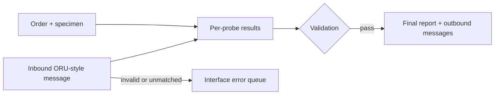

# CytoBridge - LIS Interface Simulator


A synthetic cytogenetics/FISH **Laboratory Information System (LIS) + interface
simulator**. It demonstrates SQL schema design, an order/specimen/result
workflow, audit trails, outbound HL7/FHIR-style interface generation, inbound
ORU-style ingestion with an interface error queue, validation logic, and pytest
coverage.

This is an **analyst-first, intentionally headless portfolio project**. The
reviewable artifacts are the data model, workflow rules, SQL, interfaces,
validation evidence, and troubleshooting documentation.

> **Not affiliated with Epic Systems.** This is a "Beaker-adjacent" learning
> project. It is not affiliated with, endorsed by, or connected to Epic Systems
> Corporation. It does not use Epic software, does not reproduce Epic build
> content or configuration, and contains no proprietary Epic material. "Beaker"
> is referenced only to describe the general category of laboratory information
> system this project models.

> **Data notice:** All data in this project is **synthetic**. No PHI. No real
> patient data.

**Verified on `main`:** 164 passing pytest tests across eight suites, five
end-to-end demonstration scenarios, and 41/41 requirements with result-level
automated coverage plus 18 manual UAT definitions. GitHub Actions verifies Python
3.11 and 3.12.

## Scope (v1)

v1 models exactly one panel - **AML/MDS FISH** - end to end, headless:

1. Create a synthetic patient.
2. Create an AML/MDS FISH order.
3. Receive and accession a bone-marrow specimen.
4. Enter structured, per-probe FISH results.
5. Run validation.
6. Block finalization if a required probe is missing.
7. Record validation errors.
8. Finalize the report when validation passes.
9. Audit every important state change.

**Session 2 adds outbound interface generation** (see below): a finalized order
can now be exported as an HL7 ORU^R01-style message and a FHIR
`DiagnosticReport`-style JSON Bundle, both stored in the existing
`interface_message` table.

**Session 3 adds inbound ingestion + the interface error queue** (see below):
a synthetic instrument ORU-style message can now be parsed, matched to an open
order by accession number, and either **filed** as per-probe results or routed
to the **`interface_error_queue`** with a clear reason. Every inbound message is
stored in `interface_message` (`direction = 'INBOUND'`).

**Session 4 adds a validation & portfolio documentation package** (no code
changes): numbered requirements, a requirements-to-test traceability matrix, UAT
scripts, a validation summary, risk assessment, known-issues, a change-control
log, a demo script, a Mermaid workflow diagram, and a portfolio review. See
[Validation & portfolio docs](#validation--portfolio-docs-session-4).

## Architecture at a glance



The full lifecycle, inbound path, and audit events are documented in
[`docs/workflow-diagram.md`](docs/workflow-diagram.md).

## Outbound interfaces (Session 2)

A **finalized** AML/MDS FISH order can be rendered as outbound messages:

- **HL7 ORU^R01-style** pipe-delimited text (`MSH`/`PID`/`OBR`/`SPM`/`OBX`).
- **FHIR R4-style** `DiagnosticReport` JSON `Bundle` (Patient, Specimen,
  per-probe Observations, DiagnosticReport).

Both are generated from a single snapshot so they always agree, and both can be
stored in `interface_message` (`direction = 'OUTBOUND'`) with no schema change.

> These are **educational, HL7/FHIR-*style* outputs - not certified or
> conformance-validated** implementations. They use synthetic local codes and
> must not be sent to a production interface. All data is synthetic; no PHI.

Generation is **finalized-only**: exporting a non-finalized order (or one with
missing report/specimen/result data) raises `interfaces.OutboundError` rather
than emitting an incomplete message. The field-by-field mapping is documented in
[`docs/interface-mapping.md`](docs/interface-mapping.md), with runnable samples
under [`sample_messages/outbound/`](sample_messages/outbound/).

## Inbound interfaces + error queue (Session 3)

An inbound, pipe-delimited **ORU-*style*** result message from a synthetic FISH
instrument (segments `MSH`/`PID`/`OBR`/`SPM`/`OBX`) is ingested by
`interfaces.inbound_hl7.ingest_message`:

1. The raw message is **always** stored in `interface_message`
   (`direction = 'INBOUND'`).
2. The `OBR-3` accession number is matched to an existing, **non-finalized**
   order.
3. If it matches and every `OBX` validates, the per-probe results are **filed**
   to the order (updating in place; one `INBOUND_RESULT_FILED` audit event
   records the source message).
4. If it is invalid, unmatched, or not fileable, the whole message is routed to
   **`interface_error_queue`** (`status = 'OPEN'`) with a clear reason, and
   **nothing** is filed (all-or-nothing).

Messages route to the error queue when the accession is missing, does not match
an order, or the order is already finalized; when a required segment or all
`OBX` segments are absent; when a probe code is unknown for the AML/MDS panel;
when `cells_abnormal` exceeds `cells_scored` or a numeric field is malformed; or
when the specimen type is incompatible with the panel. The inbound mapping is in
[`docs/interface-mapping.md`](docs/interface-mapping.md), an analyst runbook in
[`docs/interface-troubleshooting.md`](docs/interface-troubleshooting.md), and
runnable samples under [`sample_messages/inbound/`](sample_messages/inbound/).

> This is an **educational HL7-*style* parser** - not a certified HL7 engine
> (no MLLP framing, ACKs, or conformance validation). Line endings are lenient.
> All data is synthetic; no PHI.

## Controlled error-queue recovery (v1.1)

CytoBridge v1.1 adds a **controlled recovery** service so an analyst can safely
recover a failed inbound message that landed in `interface_error_queue`. It is a
small, headless Python service ([`src/recovery.py`](src/recovery.py)) with three
public functions - no UI, API, CLI, scheduler, or transport:

```python
from src import recovery
recovery.retry_queue_item(conn, queue_id, *, request_id, actor)
recovery.redrive_queue_item(conn, queue_id, corrected_payload, *, request_id, actor)
recovery.get_recovery_history(conn, queue_id)
```

Each failed queue item carries a structured `failure_code`, `failure_category`,
and `recovery_policy` that decide what is allowed:

- **Unchanged retry** (`RETRY_ORIGINAL`) - for an OPEN `ORDER_NOT_FOUND` item,
  once the matching order exists. It reuses an exact copy of the immutable
  original payload on a **new** message.
- **Corrected re-drive** (`REDRIVE_CORRECTED`) - for an OPEN `REDRIVE_ONLY` or
  `RETRY_OR_REDRIVE` item. It processes a caller-supplied corrected payload on a
  **new** message.
- **Terminal rejection** - `ORDER_FINALIZED` / `ORDER_CANCELLED` items are
  `TERMINAL`; recovery is rejected and never reopens or unfinalizes an order.

Safety properties (each transcribed from the frozen design, and proven by tests):

- **Immutability** - the original failed message and the queue's `raw_payload`
  are never modified; only a new recovery message can reach `FILED`.
- **Idempotency** - `request_id` is globally unique. A matching replay returns
  the recorded outcome and writes nothing; a mismatched reuse is a
  `REQUEST_ID_CONFLICT` (audit-only, fabricates nothing); a queue item has at
  most **one** `SUCCEEDED` recovery.
- **Attempt history** - every attempt (`SUCCEEDED` / `FAILED` / `REJECTED`) is
  recorded with a `payload_sha256` fingerprint and an `outcome_detail`, and is
  retrievable in order.
- **Rollback** - each operation commits or rolls back as a unit; a handled
  failure preserves the attempted message as `ERRORED` and the attempt as
  `FAILED`, rolls back all filing side effects, and leaves the queue `OPEN` for a
  later new `request_id`.

The recovery **design, requirements, and test intent were approved and frozen by
Austin before implementation**; they are pre-implementation decision records:
[`validation/v1.1-design-record.md`](validation/v1.1-design-record.md),
[`validation/v1.1-requirements.md`](validation/v1.1-requirements.md), and
[`validation/v1.1-test-intent.md`](validation/v1.1-test-intent.md). Current-state
implementation evidence lives in the
[traceability matrix](validation/traceability-matrix.md) and
[validation summary](validation/validation-summary.md). The analyst runbook is
[`docs/interface-troubleshooting.md`](docs/interface-troubleshooting.md), the
recovery flow is diagrammed in
[`docs/workflow-diagram.md`](docs/workflow-diagram.md), scenario 5 of
`python -m src.demo_run` shows representative cases, and the reviewable synthetic
corpus is under [`sample_messages/recovery/`](sample_messages/recovery/).

> The v1.1 recovery service is a **synchronous, headless, educational**
> implementation - not a production interface-engine recovery subsystem. All data
> is synthetic; no PHI.

### Technology

- **Python** (standard library only at runtime).
- **SQLite** via the stdlib `sqlite3` module.
- Raw, hand-written SQL in `schema.sql` and `queries/`. **No ORM.**
- **pytest** for tests.
- Intentionally headless - analyst interaction is demonstrated through Python,
  raw SQL, generated messages, and validation artifacts.

## Repository layout

```
schema.sql              DDL: PK/FK/CHECK constraints + AML/MDS panel seed data
queries/                Analyst SQL (parameterized where appropriate)
  turnaround_time.sql       TAT for finalized orders (hours)
  pending_review.sql        Orders awaiting review, STAT first
  stat_pending.sql          Un-finalized STAT orders, aging
  validation_error_rate.sql Share of orders with blocking errors
  audit_lookup.sql          Full audit trail for one order (bind :order_id)
  interface_error_queue.sql Open inbound interface errors
src/
  db.py                 sqlite3 helpers; parameterized queries; query loader
  workflow.py           patient/order/specimen/result/finalize + audit
  validation.py         validation rules (returns typed findings)
  reports.py            report summary + seam for a future ISCN parser
  interfaces/           interface generation + ingestion
    __init__.py             collect_report_data + store_message + shared types
    outbound_hl7.py         HL7 ORU^R01-style message generation (Session 2)
    outbound_fhir.py        FHIR DiagnosticReport-style JSON Bundle (Session 2)
    inbound_hl7.py          inbound ORU-style ingestion + error queue (Session 3)
  recovery.py           controlled error-queue recovery service (v1.1)
  demo_run.py           happy path + missing-probe + outbound + inbound + recovery
sample_messages/
  outbound/             sample generated HL7 + FHIR messages
  inbound/              sample inbound instrument ORU-style messages
  recovery/             synthetic recovery corpus (originals + corrected) (v1.1)
docs/
  interface-mapping.md         outbound + inbound field-by-field mapping
  interface-troubleshooting.md analyst runbook + controlled recovery workflow
  demo-script.md               ~6-minute screen-share walkthrough
  workflow-diagram.md          Mermaid workflow + interface + recovery diagrams
  portfolio-review.md          what it proves / Epic boundary / resume
  hiring-manager-review.md     scorecard + resume/interview framing
validation/                    validation package
  requirements.md              v1 numbered requirements (R-001...R-019)
  v1.1-design-record.md        frozen v1.1 design decision record (pre-impl)
  v1.1-requirements.md         frozen v1.1 requirements (R-020...R-041) (pre-impl)
  v1.1-test-intent.md          frozen v1.1 test intent (pre-impl)
  traceability-matrix.md       requirement -> code -> test -> UAT (R-001...R-041)
  uat-test-scripts.md          manual analyst UAT scripts (UAT-001...UAT-018)
  validation-summary.md        approach + results summary
  known-issues.md              limitations and tracked issues
  change-control-log.md        per-session + v1.1 task change history
  risk-assessment.md           synthetic LIS/interface + recovery risks
tests/
  test_workflow.py      workflow lifecycle + audit + constraints
  test_validation.py    validation rules
  test_outbound_interfaces.py  outbound HL7/FHIR generation + export gating
  test_inbound_interfaces.py   inbound ingestion + error-queue routing
  test_queries.py              result assertions for analyst SQL views
  test_recovery_schema.py      v1.1 recovery schema + constraints
  test_failure_classification.py  v1.1 structured failure classification
  test_recovery_service.py     v1.1 controlled recovery service behavior
```

## Data model highlights

- **Real constraints:** primary keys, foreign keys (`PRAGMA foreign_keys = ON`),
  and `CHECK` constraints - e.g. `cells_abnormal <= cells_scored`, enumerated
  order/specimen/interpretation statuses, and a rejected specimen must carry a
  reason.
- **One result per probe per order** (`UNIQUE (order_id, probe_id)`);
  re-entering a probe updates the existing row.
- **Audit trail** (`audit_event`) records every state change with entity, action,
  actor, and detail.
- **Validation findings** are typed (`ERROR` blocks finalize; `WARNING` is
  advisory) and persisted to `validation_error`.

## Validation rules (v1)

| rule_code | severity | meaning |
|---|---|---|
| `SPEC_ACCESSIONED` | ERROR | Specimen must be received and accessioned (not rejected/missing) |
| `MISSING_PROBE` | ERROR | Every required probe must have a result |
| `ABN_EXCEEDS_SCORED` | ERROR | Abnormal cells cannot exceed scored cells |
| `INTERP_CONSISTENCY` | ERROR/WARN | Interpretation must agree with percent-abnormal vs probe cutoff |
| `CELL_COUNT_LOW` | WARNING | Scored-cell count below the minimum threshold |

The consistency check is **cutoff-aware**: a percent-abnormal at/above a probe's
`abnormal_cutoff_percent` that is still called `NORMAL` is a blocking error
(missed abnormal), while an `ABNORMAL` call below cutoff is an advisory warning.

## Run the demo

From the repo root:

```bash
python -m src.demo_run
```

This runs five scenarios against a fresh in-memory database: a complete order
that passes validation and finalizes (with report summary and audit trail
printed); an order missing a required probe whose finalization is **blocked**
with the validation findings shown; outbound export of the finalized order to
HL7 ORU + FHIR `DiagnosticReport` messages stored in `interface_message`; inbound
ingestion - a valid instrument message filing probe results to an open order,
alongside unmatched/malformed messages landing in the interface error queue; and
controlled recovery of failed messages - a corrected re-drive, an unchanged
ORDER_NOT_FOUND retry, a handled failure followed by a later success, and
duplicate/replay/`REQUEST_ID_CONFLICT` protection, all through the public
recovery service.

## Run the tests

```bash
pip install -r requirements-dev.txt   # pytest only
python -m pytest -q                   # 164 tests
```

GitHub Actions runs the full test suite and demonstration scenarios on Python
3.11 and 3.12 for every push and pull request.

## Repository maintenance

- [`CONTRIBUTING.md`](CONTRIBUTING.md) defines development, validation, synthetic-data, and scope-control expectations.
- [`SECURITY.md`](SECURITY.md) defines vulnerability reporting and data-safety response.
- [`LICENSE`](LICENSE) makes the project available under the MIT License.
- [`.github/dependabot.yml`](.github/dependabot.yml) schedules monthly Python and GitHub Actions dependency updates.
- [`.github/pull_request_template.md`](.github/pull_request_template.md) provides a validation and safety checklist for proposed changes.

## Validation & portfolio docs (Session 4)

A documentation package demonstrating a validation mindset over Sessions 1-3
(no code changes):

- **Validation package** ([`validation/`](validation/)):
  [requirements](validation/requirements.md) /
  [traceability matrix](validation/traceability-matrix.md) /
  [UAT scripts](validation/uat-test-scripts.md) /
  [validation summary](validation/validation-summary.md) /
  [known issues](validation/known-issues.md) /
  [change-control log](validation/change-control-log.md) /
  [risk assessment](validation/risk-assessment.md)
- **Walkthrough & review** ([`docs/`](docs/)):
  [5-minute demo script](docs/demo-script.md) /
  [Mermaid workflow diagram](docs/workflow-diagram.md) /
  [portfolio review](docs/portfolio-review.md) (what it proves, the Epic/Beaker
  boundary, resume bullets, and interview talking points) /
  [hiring-manager review](docs/hiring-manager-review.md) (scorecard + resume/LinkedIn framing)

Every requirement (`R-001`-`R-041`) traces to the code (file/function or schema
constraint), result-level automated `pytest` coverage, and a manual UAT script
(`UAT-001`-`UAT-018`). Automated coverage passes today; the manual UAT layer is
defined but not executed. This is **Beaker-adjacent learning, not Epic build
experience** - see [portfolio review](docs/portfolio-review.md).

## Roadmap

Done:

- [x] HL7 ORU-style outbound message generation (Session 2).
- [x] FHIR `DiagnosticReport` JSON generation (Session 2).
- [x] Inbound instrument ORU-style ingestion: file valid messages to open orders;
  route malformed/unmatched messages to the interface error queue with a clear
  reason (Session 3).
- [x] Validation & portfolio documentation package: requirements, traceability
  matrix, UAT scripts, risk assessment, demo script, workflow diagram
  (Session 4).
- [x] Repository CI and maintenance baseline: automated tests/demo, licensing,
  security policy, contribution guidance, Dependabot, and PR checklist.
- [x] Controlled error-queue recovery (v1.1): headless retry / corrected
  re-drive / attempt history with original-message immutability, idempotency,
  transaction-safe rollback, and terminal rejection - designed and approved by
  Austin, implemented and validated under bounded tasks (P2-001, P3-001 - P3-004).

Next bounded enhancements:

- [ ] ISCN nomenclature parser (seam already present in `reports.py`).

The headless interface is deliberate. A UI, production transport, additional
panels, authentication, and clinical deployment remain outside this project's
scope so the portfolio signal stays focused on LIS/interface analyst work.
