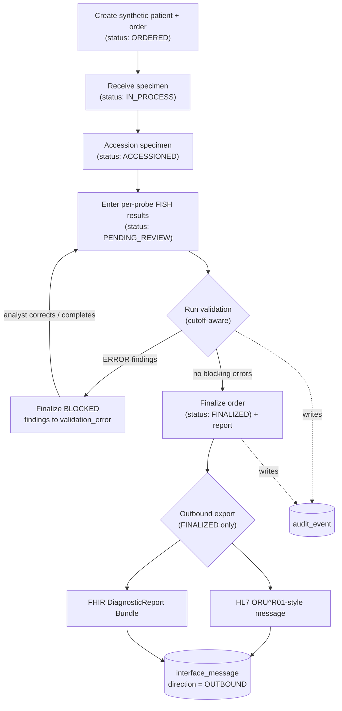
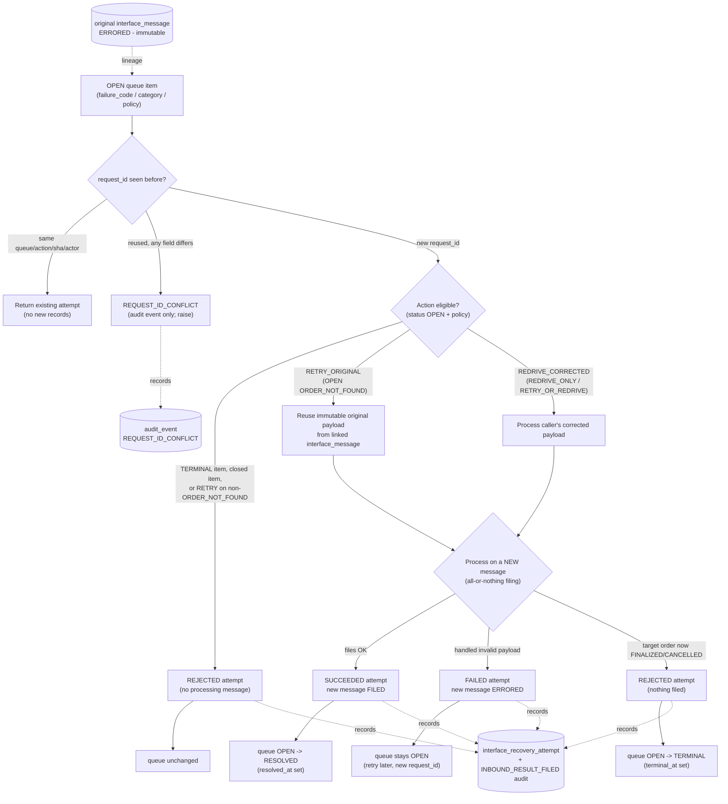
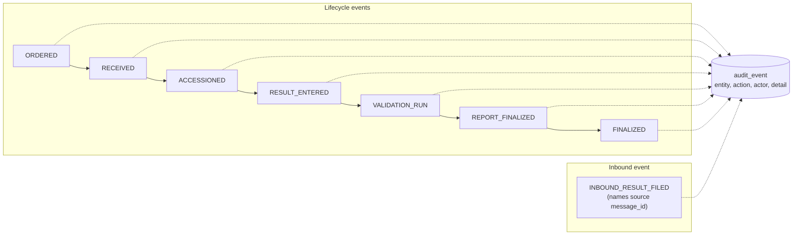

# Workflow diagram

The CytoBridge AML/MDS FISH lifecycle and its interface paths, in Mermaid. Four
views: the **order lifecycle -> finalize -> outbound**, the **inbound ingestion**
path, the **controlled error-queue recovery** flow (v1.1), and the cross-cutting
**audit trail**. GitHub renders the ```mermaid``` blocks below.

> **Synthetic learning project - no PHI.** Educational, HL7/FHIR-*style* only.
> Recovery is a **synchronous, headless Python service** - there is no UI,
> background worker, asynchronous queue, or production interface engine.

## 1. Order lifecycle -> validation -> finalization -> outbound



Non-finalized or data-incomplete orders cannot be exported - `collect_report_data`
raises `OutboundError` (requirements R-008, R-009).

## 2. Inbound ORU ingestion -> filing or error queue


Because filing is **all-or-nothing**, a message with any invalid OBX files
*nothing* - the order is never left half-updated (requirements R-010-R-018).

## 3. Controlled error-queue recovery (v1.1)

A compact view of one recovery request against an `OPEN` queue item, through the
headless `recovery` service. `request_id` resolution happens first; then the
stored classification and eligibility decide retry vs corrected re-drive vs
rejection. The **original failed message is immutable** and only a new message
can reach `FILED`.



Key invariants (requirements R-022-R-041): the original message and the queue
`raw_payload` are never modified; only a new recovery message may reach `FILED`;
a queue item has **at most one** `SUCCEEDED` attempt; a handled failure rolls
back all filing side effects (queue stays `OPEN`) while preserving the `ERRORED`
message and `FAILED` attempt; and recovery never creates a second error-queue
item.

## 4. Audit trail (cross-cutting)



Every important state change writes an `audit_event` (requirement R-007); inbound
filings add an `INBOUND_RESULT_FILED` event linking the results back to the
interface message that produced them (R-016). A successful controlled recovery
files through the same seam, so it emits the same `INBOUND_RESULT_FILED` event
(now on a new recovery message), and a mismatched `request_id` reuse adds a
`REQUEST_ID_CONFLICT` audit event (R-040, R-041). Review a single order's trail
with `queries/audit_lookup.sql`.
