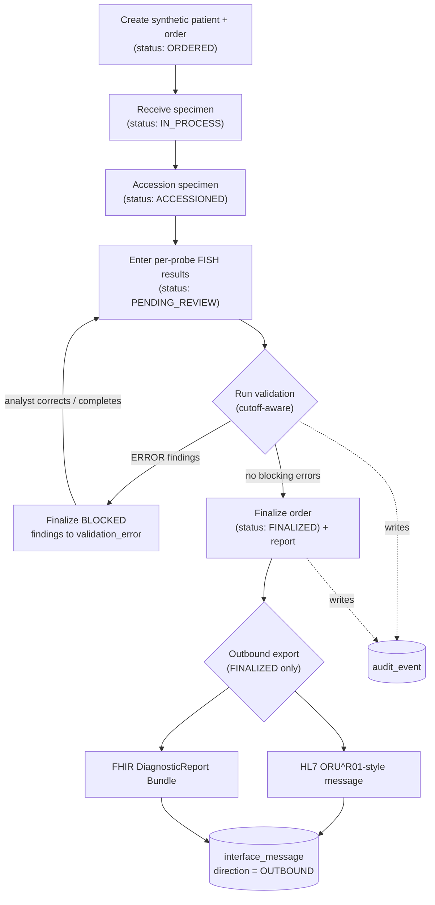
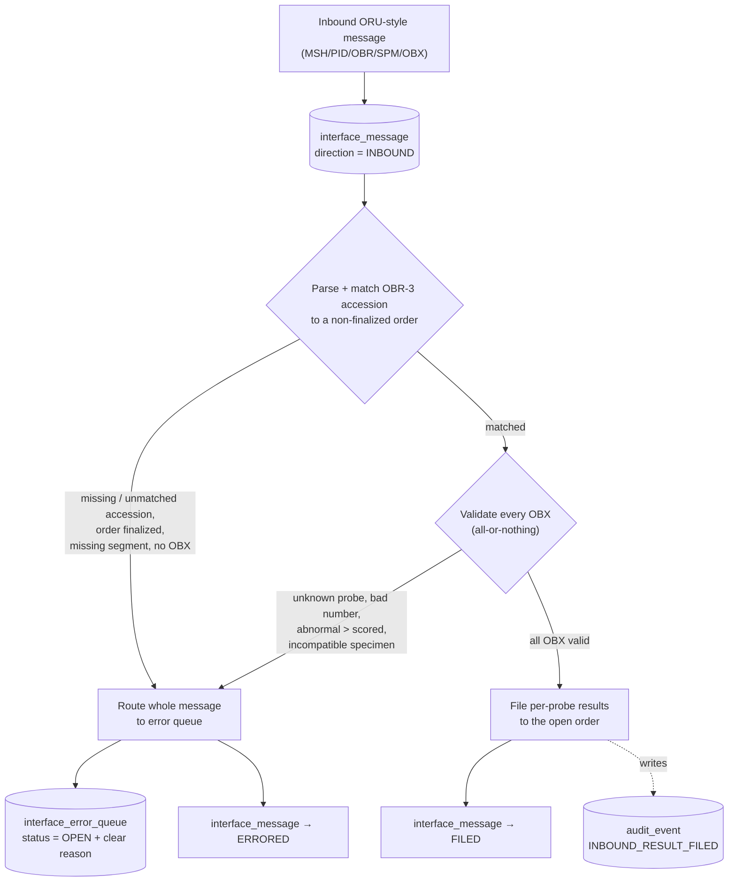
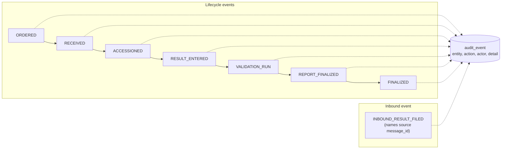

# Workflow diagram

The CytoBridge AML/MDS FISH lifecycle and its interface paths, in Mermaid. Three
views: the **order lifecycle → finalize → outbound**, the **inbound ingestion**
path, and the cross-cutting **audit trail**. GitHub renders the ```mermaid```
blocks below.

> **Synthetic learning project — no PHI.** Educational, HL7/FHIR-*style* only.

## 1. Order lifecycle → validation → finalization → outbound



Non-finalized or data-incomplete orders cannot be exported — `collect_report_data`
raises `OutboundError` (requirements R-008, R-009).

## 2. Inbound ORU ingestion → filing or error queue



Because filing is **all-or-nothing**, a message with any invalid OBX files
*nothing* — the order is never left half-updated (requirements R-010–R-018).

## 3. Audit trail (cross-cutting)



Every important state change writes an `audit_event` (requirement R-007); inbound
filings add an `INBOUND_RESULT_FILED` event linking the results back to the
interface message that produced them (R-016). Review a single order's trail with
`queries/audit_lookup.sql`.
